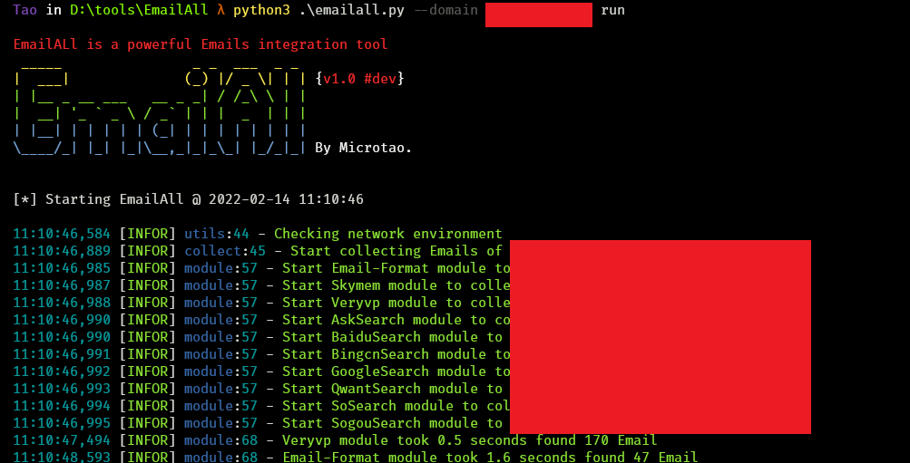
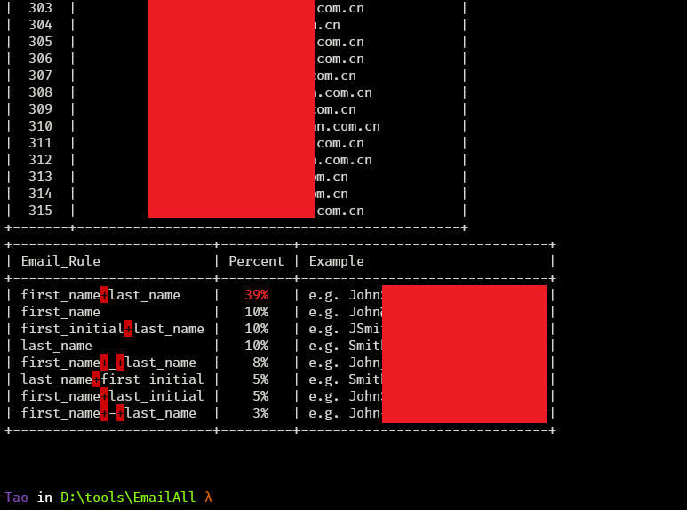

<h1 align="center" >EmailAll</h1>

<h3 align="center" > A powerful Email Collect tool</h3>

## 0x1 介绍

:astonished: `EmailAll` is a powerful Email Collect tool —— 一款强大的邮箱收集工具






## 0x2 安装&使用

```bash
$ git clone https://github.com/Taonn/EmailAll.git
$ cd EmailAll
$ pip3 install -r requirements.txt
```

```python
EmailAll is a powerful Email Collect tool

Example:
    python3 emailall.py check
    python3 emailall.py --domain example.com run
    python3 emailall.py --domains ./domains.txt run
```

` python3 emailall.py --domain example.com run`

`python3 emailall.py --domains ./domains.txt run`

最终结果保存至`result`目录，分为不同模块json数据文件和汇总`{domain}_All.json`文件

## 0x3 配置

proxy配置在 [setting.py](config/setting.py)文件

```python
proxy={'http': '127.0.0.1:2333', 'https': '127.0.0.1:2333'}
```

API配置在 [api.py](config/api.py)文件

```python
# http://www.veryvp.com/
veryvp_username = ''
veryvp_password = ''

# https://www.github.com
github_token = ''

# https://app.snov.io/
snov_username = ''
snov_password = ''

# https://phonebook.cz/
pb_key = ''
```

- `veryvp`和`snov`去网站免费注册
- `GitHub`的token去设置里创建一个即可
- `phonebook`的key访问https://phonebook.cz/然后查看源代码，将`API_KEY`的值填入即可

## 0x4 模块

邮箱信息收集主要来源如下：

- Search
  - Ask
  - Baidu
  - Bing
  - Google
  - QWant
  - SO
  - Sougou
  - GithubApi
- DataSets
  - Email-Format
  - Skymem
  - Veryvp
  - PhoneBook
  - Snov

### 2022.2.19

更新PhoneBook、Snov模块


### 2022.2.16

更新GithubApi模块


> 后续还会更新~

更多信息请关注[changes.md](docs/changes.md)

## 0x5 参考

参考了以下优秀的工具，并修改而来:

- https://github.com/shmilylty/OneForAll
- https://github.com/laramies/theHarvester
- https://github.com/m4ll0k/Infoga

感谢这些师傅们的分享！！！

## 0x6 感谢

感谢网上开源的各大项目！！！

- 特别感谢[Se7en](https://github.com/r00tSe7en)师傅对于接口的补充

## 0x7 免责声明

​	本工具仅能在取得足够合法授权的企业安全建设中使用，在使用本工具过程中，您应确保自己所有行为符合当地的法律法规。 如您在使用本工具的过程中存在任何非法行为，您将自行承担所有后果，本工具所有开发者和所有贡献者不承担任何法律及连带责任。 除非您已充分阅读、完全理解并接受本协议所有条款，否则，请您不要安装并使用本工具。 您的使用行为或者您以其他任何明示或者默示方式表示接受本协议的，即视为您已阅读并同意本协议的约束。

